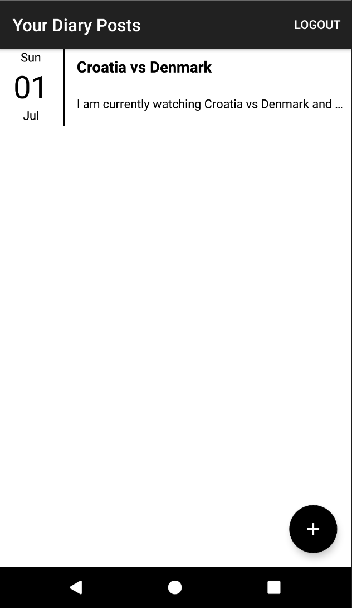

# Jounrally
This is a project for the ALC Android Developer Challenge. The Jounrally App allows a user to login with their Google account into the app and make diary entries to a local DB on their phone. The user is also given the ability to log out of the app. 

# Using Jounrally - Step 1

Install the app on an Android Device and press the get started button.

# Using Jounrally - Step 2
Yout then get to a screen as below:

Click the plus icon to add a new post or you can just press the current post that appears to go to the diary entry. By pressing either of these you will go to a screen that looks like below:
